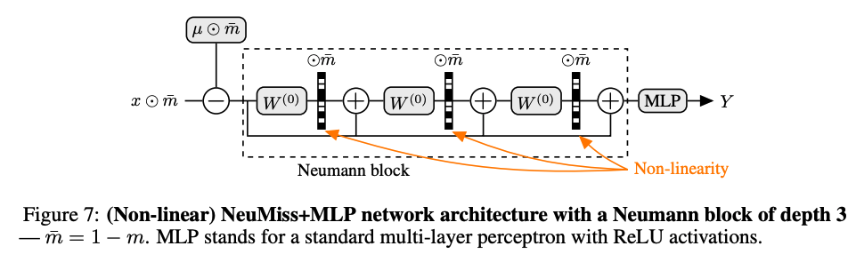

# NeuMiss

This repo provides a PyTorch module implementing NeuMiss, a neural network architecture designed for learning with missing values.

The NeuMiss block is implemented in `NeuMissBlock`. It takes as input a vector with missing values and outputs a vector of the same size as the input, without mising values. It is thus necessary to chain it with subsequent layers appropriate to the prediction task. As an example we provide `NeuMissMLP`, where the NeuMiss block is chained with an MLP. The `NeuMissBlock` can be used like any other PyTorch layer, and can easily be chained with other architectures (ResNets, ...).

Below is a diagram of a NeuMiss block chained with an MLP:



For more details, please refer to the papers introducing NeuMiss:
* [NeuMiss networks: differentiable programming for supervised learning with missing values.](https://proceedings.neurips.cc/paper/2020/file/42ae1544956fbe6e09242e6cd752444c-Paper.pdf)

* [What’s a good imputation to predict with missing values?](https://papers.nips.cc/paper/2021/file/5fe8fdc79ce292c39c5f209d734b7206-Paper.pdf)

The architecture implemented corresponds to the latest version (i.e. with shared weights) introduced in the second paper.

## Install
Clone this repository and install it with pip in the environment of your choice (venv, conda...):
```bash
pip install .
```

## Use NeuMiss
Below, we show how to train `NeuMissMLP` on a simple synthetic dataset.

Import the required modules. 
```python
import torch.nn as nn
from torch.utils.data import DataLoader
from torch.optim.lr_scheduler import ReduceLROnPlateau
from neumiss import NeuMissMLP
from utils import get_example_dataset, get_optimizer_by_group, train_model, \
    compute_preds, compute_regression_metrics
```

Generate a synthetic dataset. Here, we generate Gaussian data (10,000 samples, 10 features) with 50% MCAR missing values. The response is generated linearly from the complete data. Note that with NeuMiss, it is not necessary to impute the data. The `NeuMissBlock` expects and handles `NaN` in the inputs.

```python
ds_train, ds_val, ds_test = get_example_dataset()
p = ds_train.tensors[0].shape[1]  # n_features

train_loader = DataLoader(ds_train, batch_size=200, shuffle=True)
val_loader = DataLoader(ds_val, batch_size=200)
test_loader = DataLoader(ds_test, batch_size=200)
```

Instantiate a `NeuMissMLP` network.
```python
model = NeuMissMLP(n_features=p, neumiss_depth=10, mlp_depth=0, mlp_width=p)
```

Instantiate an optimizer, a scheduler and a loss.
```python
optim_hyperparams = {'weight_decay': 0, 'lr': 1e-3}
optimizer = get_optimizer_by_group(model, optim_hyperparams)

sched_hyperparams = {'factor': 0.2, 'patience': 10, 'threshold': 1e-4}
scheduler = ReduceLROnPlateau(optimizer, mode='min', **sched_hyperparams)

criterion = nn.MSELoss()
```

Train the model.
```python
train_model(model, criterion, train_loader, val_loader, optimizer,
            scheduler, early_stopping=False, n_epochs=500, lr_threshold=1e-6)
```

Compute prediction scores.
```python
train_loader = DataLoader(ds_train, batch_size=200, shuffle=False)
pred = compute_preds(model, train_loader, val_loader, test_loader,
                     classif=False)

res = {}
splits = ['train', 'val', 'test']
preds = [pred[split] for split in splits]
y_labels = [ds_train.tensors[1], ds_val.tensors[1], ds_test.tensors[1]]

for split, pred, y_label in zip(splits, preds, y_labels):
    res_split = compute_regression_metrics(pred, y_label)
    for metric, value in res_split.items():
        res[f'{metric}_{split}'] = value

print(res)
```
